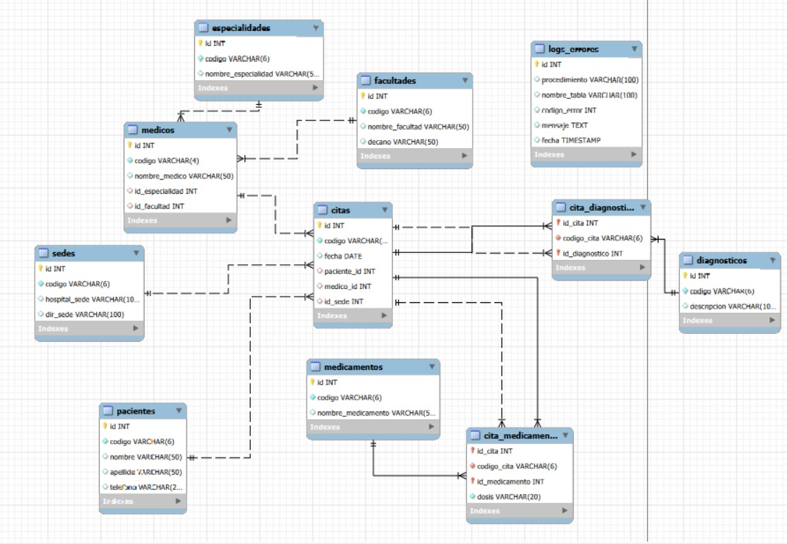

#  Clínica Universitaria - Base de Datos

## 📌 Descripción

Este proyecto consiste en el diseño e implementación de una base de datos para la gestión de una clínica universitaria.

El sistema permite administrar información sobre:

* Pacientes
* Médicos
* Citas
* Diagnósticos
* Medicamentos
* Sedes

Se aplicaron principios de **normalización hasta Cuarta Forma Normal (4FN)** para evitar redundancias y garantizar la integridad de los datos.

---

## 🧠 Modelo de Datos

La base de datos está estructurada en las siguientes tablas principales:

## ⚙️ Tecnologías utilizadas

* MySQL
* MySQL Workbench

---

## 🧩 Normalización

Se aplicaron las siguientes formas normales:

* **1FN:** Eliminación de datos repetitivos (medicamentos separados en filas)
* **2FN:** Separación de dependencias parciales
* **3FN:** Eliminación de dependencias transitivas
* **4FN:** Separación de relaciones multivaluadas (diagnósticos y medicamentos)

---

## 🔄 Operaciones CRUD

Se implementaron procedimientos almacenados (CRUD) para las entidades principales:

###  Pacientes

* Insertar paciente
* Consultar pacientes
* Actualizar paciente
* Eliminar paciente

###  Citas

* Insertar cita
* Consultar citas (con JOIN)
* Actualizar cita
* Eliminar cita

---

##  Funciones implementadas

Se crearon funciones para:

* Total de doctores por especialidad
* Total de pacientes por médico
* Total de pacientes por sede

---

##  Manejo de errores

Se implementó una tabla de logs:

* `logs_errores`

Esta tabla almacena:

* Procedimiento donde ocurrió el error
* Tabla afectada
* Código del error
* Mensaje
* Fecha y hora

---

# Modelo EER

##  Autor

Ximena Afanador
